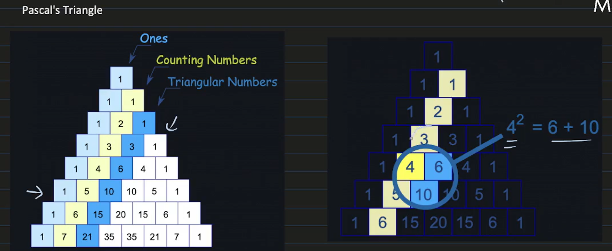
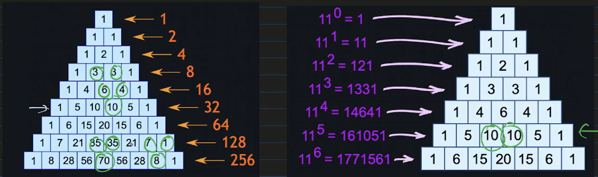

# Combinatorics

## Binomial Coefficients

$C\binom{n}{k}$ is define as the coefficient of $x^k$ in the expansion of $(1 + x)^n$
$C\binom{n}{k}$  gives the number of ways of choosing $k$ objects out of $n$ objects

**$C\binom{n}{k} = C\binom{n - 1}{k - 1} + C\binom{n - 1}{k} $**

$ => f(i, j)  = f(i - 1, j - 1) + f(i - 1, j)$

## Pascal's Triangle

## Number of ways to partition n into positive integers
### Ordered set
$f(n) = f(n - 1) + f(n - 2) + ... + f(0)$
$<=> f(n) = \sum_{i=1}^{n} f(n - i) $

## We have n boys and n girls, number of way to make a team n people

**$\sum_{i = 1}^{n} {C\binom{n}{i}}^2 = \sum_{i = 1}^{n} C\binom{n}{i} * C\binom{n}{n - i} = C\binom{2n}{n} $**
