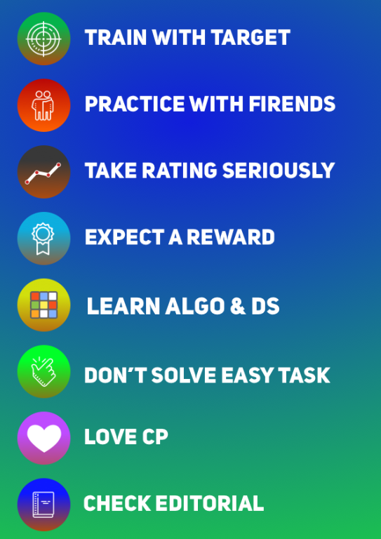

# From Newbie to Expert in 6 months
 From my experience, I would like to share those important tips from my point of view:

## Step 2: from 1200(green) to 1400(cyan)
- In order to get to cyan, you should know basic dp, greedy, bit operation, and math. Other things such as graph theory are not required to go to cyan.

- First, you should learn about the algorithms. First, you need to know the concept of them, and you should practice. Practicing these algorithms can be done by solving 1300~1500 rated problems having these tags. You should see editorials quickly(15 mins) to learn fast.

- You need to solve 4 problems in div3(You don't need fast solving) or 2~3 problem in div2(highly depends on difficulty, if it's 2 problems, you need to do fast solving). I would recommend to solve 1300~1600 rated problem(you can tag search them) and try to solve them in 15~30 mins and see editorial after 30 mins.